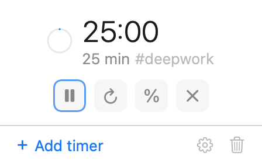

# OsumTimer

A menu bar timer for macOS. Type `25`, hit return, and it counts down in the corner.


Each timer is its own menu bar item. No Dock icon, no window.

## Install

```sh
brew tap vigneshmr/osumtimer
brew trust vigneshmr/osumtimer   # newer Homebrew asks before loading third-party taps
brew install osumtimer
```

Or download the `.dmg` from [Releases](../../releases). The build isn't notarized, so on first launch right-click → **Open**.

Requires macOS 14+.

## Usage

| You type | You get |
| --- | --- |
| `25` | 25 minutes |
| `45m` · `2h` · `30s` · `1h30m` | that duration |
| `3 minutes` · `2 hours` | words work too |
| `1:30` · `1:30:45` | stopwatch-style |
| `@5pm` · `until 14:00` | ends at that time |
| `#deepwork 25` | 25 minutes, labelled **deepwork** |



- Multiple timers, each with its own menu bar item. Drag to reorder.
- The alarm sound is played by the app, not the notification, so Focus modes don't mute it. It rings until you click it.
- A timer can show as a percentage instead of a clock.
- Timers survive a relaunch.
- Recent inputs are one click away.
- Native Swift. No network access.

## Build

```sh
make run       # run from source
make test
make package   # build/OsumTimer.app and a .dmg
```
